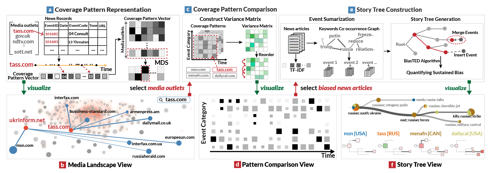
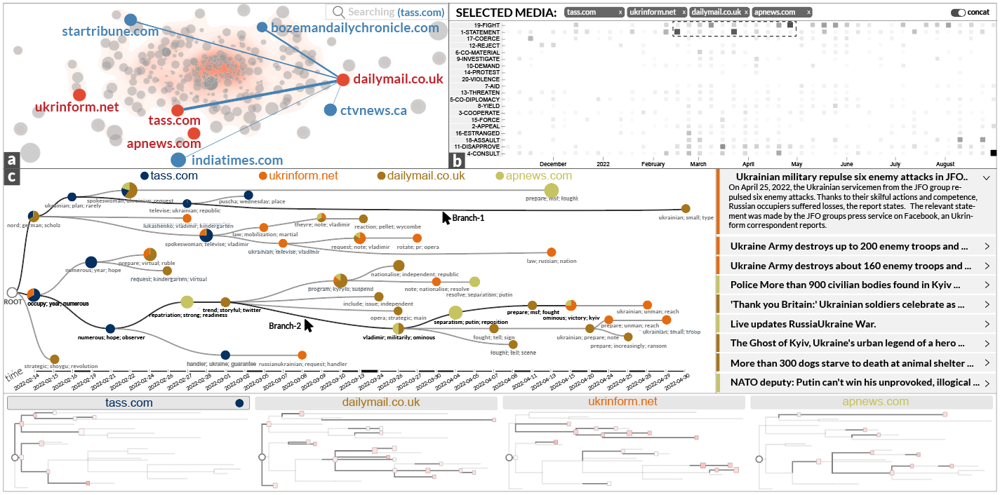

# BiaSeer: An Interactive Visual Analytics System for Identifying and Understanding Media Bias
This is the code repository for BiaSeer.

We develop BiaSeer, a novel visual analytics system that enables the identification and understanding of sustained bias in media coverage.
BiaSeer builds an overview of the media coverage patterns to assist users in refining the analysis scope of media outlets.
It visualizes the variances in coverage patterns among different media outlets to facilitate the identification of biased news articles.
To investigate sustained bias, BiaSeer summarizes news articles into events, connects these events into a narrative structure, and enables analysts to compare the narrative structure of each media outlet using the juxtaposition-based approach.

## Pipeline


This picture shows the pipeline of the Biaseer prototype system. The top row (a, c, e)shows the media bias analysis framework, and the bottom row (b, d, f) shows the visualizations in BiaSeer.
**(a)** The coverage pattern representation component computes coverage patterns of different media outlets based on a pre-processed dataset.
**(b)** The media landscape view visualizes the distributions of coverage patterns and adds interconnections among media outlets. Users can select or search the media outlets to determine the media outlets from the media landscape view. 
**(c)** The coverage pattern comparison component computes the variance matrix based on the selected media outlets and then rearranges the results to facilitate the identification of news articles with sustained bias. 
**(d)** The pattern comparison view provides a variance overview of media coverage patterns across event categories. Users can select news articles with sustained bias in the pattern comparison view. 
**(e)** The story tree construction component extracts events from the selected news articles and connects the events to build the story tree. 
**(f)** The story tree view presents the generated story trees for further exploration and enables users' comparison.

## Prototype System


This picture shows the user interface of the Biaseer prototype system. It consists of three views, including **(a)** the Media Landscape View, **(b)** the Pattern Comparison View, and **(c)** the Story Tree View. These three interactive views support the process of the identification and understanding of sustained bias in media coverage.


## Usage

Here, we provide steps for reproducing results. To build and run this project on your own, you need to run the back-end and the front-end simultaneously. We offer quick steps to get started.

### Step 1. Repository Clone

~~~
$ mkdir ViewBiaseer

$ cd ViewBiaseer

$ git clone git@github.com:biaseer/Biaseer.git
~~~

### Step 2. Data Preparation
We have already crawled and processed [the data](https://github.com/biaseer/preprocess) required by the system and the corresponding data format in advance.
~~~
$ cd ViewBiaseer

$ git clone git@github.com:biaseer/preprocess.git
~~~

### Step 3. Backend Services
In the project, we extract the module for building the story tree into a jar package for easy calling, so you need to install [the Java environment](https://docs.oracle.com/javase/8/docs/technotes/guides/install/install_overview.html) first.

~~~
$ java -version
java version "1.8.0_251"
Java(TM) SE Runtime Environment (build 1.8.0_251-b08)
Java HotSpot(TM) 64-Bit Server VM (build 25.251-b08, mixed mode)
~~~
Go to the back-end folder.
~~~
$ cd Biaseer

$ cd backend
~~~
Run the server.
```
$ python main.py
```

### Step 4. Frontend Views
Go to the front-end folder.
~~~
$ cd Biaseer

$ cd frontend
~~~
Project setup.
```
npm install
```

Compiles and hot-reloads for development.
```
npm run serve
```

Compiles and minifies for production.
```
npm run build
```
Visit http://localhost:8080/ to view the Biaseer prototype system.


## Acknowledgment

### [The GDELT Project](https://www.gdeltproject.org/)
**A Global Database of Society**. Supported by Google Jigsaw, the GDELT Project monitors the world's broadcast, print, and web news from nearly every corner of every country in over 100 languages and identifies the people, locations, organizations, themes, sources, emotions, counts, quotes, images and events driving our global society every second of every day, creating a free open platform for computing on the entire world.

We developed a semi-automated news text crawling framework based on the original raw data provided by GDELT and obtained the data (related to the Russia-Ukraine conflict) input required by our system after data cleaning and processing.


### [Story Forest](https://github.com/BangLiu/StoryForest)
**Story Forest**. A repository implements the Story Forest system for event clustering and story generation.

Based on the node-aware (utilized in StoryForest), we provide the path-aware construction method. We evaluate the effectiveness by comparing the path-aware and the node-aware construction methods using the dataset related to the Russia-Ukraine conflict. Finally, We demonstrate the utility and usability of BiaSeer through a case study with news editors.